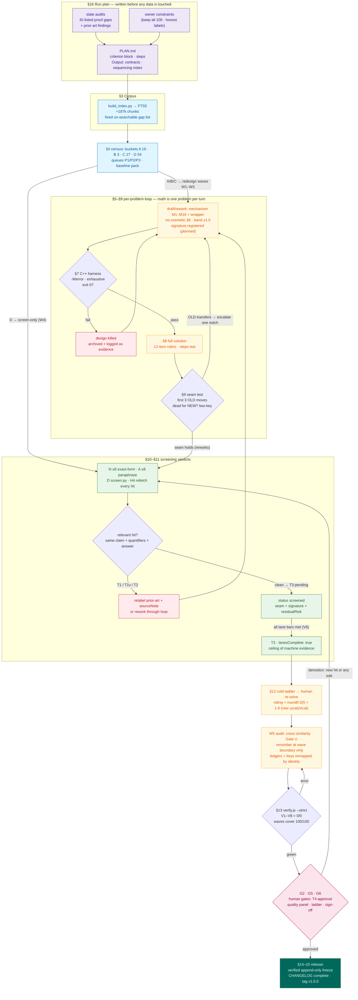

# METHODOLOGY — the complete, unambiguous production protocol

Version 1.0 · 2026-09-30 (this document's version tracks the dataset:
`readiness.release.version` 1.0.0). Every number, enum, threshold and state transition in
this file is taken from the live artifacts (`problems.js`, `tools/verify.js`,
`tools/screen.py`, `tools/lanes.py`, `tools/renumber.js`, `tools/signatures.json`,
`tools/waves.json`, `README` of `tools/corpus/`) and was re-verified against them
on 2026-09-30.

**Precedence when documents disagree:** (1) the code in `tools/` is normative for
gates and thresholds; (2) `problems.js` (data + `readiness`) is normative for
state; (3) `CHANGELOG.md` is normative for history; (4) this document is
normative for *procedure and vocabulary*. If you change (1), update this file in
the same commit.

This document supersedes the retired dated plans (PLAN.md 2026-09-27; the
2026-09-29 novelty census and transformation plan v3.0). The full 2026-09
production log (`CHANGELOG.md`, ~1,050 lines) is archived out-of-repo at
`../imo_shortlist.CHANGELOG.full-2026-09.md`; the repo ships
`CHANGELOG.example.md` with the mandatory entry format.

---

## The creation flow (map)

Section refs on every box; edges show the loops (design killed by harness,
OLD-proof transfers at the seam, relevant hits forcing rework/relabel, human
demotion) that make the protocol self-correcting rather than linear.



*Snapshot (2026-09-30): 8 entries have completed the full lane bar → T3; the
other 37 transformed items sit at T3-pending awaiting StackExchange quota
cycles; 55 are T0. Flow in words: plan(§16) → corpus(§3) → census(§4) →
per-problem design→harness→proof→seam(§5–§9) →
lanes→verdict(§10–§11) → calibration→renumber→V-gates(§12–§13) →
human gates(§13.3/§14) → release(§14–§15). Reproduce a whole set from zero: §17.*

---

## 0. Roles and write discipline

| Role | Authority |
|---|---|
| **Orchestrator (single writer)** | the only actor allowed to edit `problems.js`, ledgers and `CHANGELOG.md` in a run (`readiness.policy.singleWriter: true`); applies verdicts produced by others; performs the H4 refetch; runs gates |
| **Agents (solver/design/audit)** | produce artifacts: drafts, proofs, `tools/proofs/<id>.cpp` harnesses, cold-solve logs, screen adjudications. Their recall output is *hypothesis only* (`recallIsHypothesisOnly: true`); they never edit the dataset |
| **Human (owner)** | sole authority for: T4/`original-source` promotion (`candidateRequiresHumanApproval: true`), the final difficulty ladder + `confidence`, quality-panel scores, and all six decisions in §14 |

Cadence rules (hard, not stylistic): mathematical work — redesigns, proof
repairs, cold solves — is **one problem per turn**; mechanical work — screens,
ledger updates, renumber bookkeeping — may batch 5–10 problems per turn;
**half a wave is never committed**.

Run identifiers: `RUN-YYYYMMDD-NN` (current: `RUN-20260930-02`); stamped into
`readiness.runId` and every CHANGELOG entry of that run.

## 1. The three labels, exactly

Each problem carries three **independent, never-merged** labels:

1. **Difficulty** — `rating`: 1.0–10.0 in 0.5 steps; `difficulty` (derived:
   `easy` [1.0,4.0) · `medium` [4.0,6.0) · `hard` [6.0,8.0) ·
   `challenging` [8.0,10.0] — boundaries per `bandOf` in verify.js); `stars`
   = band index 1–4; `confidence`: `high` = human re-solved or double-checked
   the estimate; `medium` = human estimate with a caveat; `low` = explicitly
   flagged doubtful by the human (11 problems at 2026-09-30).
2. **Proof** — `proofStatus` ∈ {absent ⇒ *unaudited*, `hold`, `verified`,
   `fail`}; `gapNote` required iff `hold`. `verified` means every one of the 12
   rubric items (§8) passed, *not* that the answer is believed.
3. **Originality** — `novelty.status` ∈ {`unverified`, `screened`, `hold`,
   `prior-art`, `original-source`} (public coarse label) +
   `readiness.novelty.verdict` ∈ {`T0`, `T1`, `T1v`, `T2`, `T3-pending`, `T3`,
   `T4`} (protocol outcome, §11) + `lanesComplete` + `laneSummary{N,A,D}` +
   `residualRisk`; `sourceNote` required iff status `prior-art`.

There is a fourth, **legacy optional field `status`** ("false" | "open" |
"verified") meaning the editorial state of the *claim itself*; it is unused —
0/100 problems set it (2026-09-30); the `answer` field carries classifications.

**Label coupling (verified against data 2026-09-30):**

| verdict | novelty.status | lanesComplete | count |
|---|---|---|---|
| `T0` | `unverified` | false | 55 |
| `T3-pending` | `screened` | false | 37 |
| `T3` | `screened` | **true** | 8 |
| one legacy exception | `screened-reformulated` (c24) | false | 1 — *pending governance: fold into the enum or relabel to `screened`* |

Current proof label: 44 `verified`, 56 unaudited, 0 hold, 0 fail. Current
originality label: 0 `prior-art` — every exact/variant/classical hit found in
the 2026-09-29 census was **transformed** (§6–§11 pipeline) rather than left
labeled; relabel remains a legal fallback (§11, T1 row).

## 2. Required fields per shipped problem

`id` (a1..a25/c1..c25/g1..g25/n1..n25, **number = rating order inside the
category**), `category` ∈ {alg,cmb,geo,nt}, `rating`, `difficulty`, `stars`,
`confidence`, `text` (HTML+TeX, `$…$`/`$$…$$`, `&lt;`/`&gt;` for inequalities),
`why` (mathematical content only — key ideas, exact facts, higher-math
connections; no process chatter), `answer` (mandatory, non-empty), `steps`
(mandatory, ≥3 ordered hints, added only after the proof passed §8), and the
optional metadata above. No field outside this contract (verify + governance
review reject strays). `problems.js` refuses to load if the end-of-file
`assertInvariants` fails; `readiness.changeAudit` lists every field changed per
run with a one-line reason each.

Environment: tools read `CORPUS_DB` (default `/tmp/kilo/corpus.db`) and
`SCREENS_DIR` (default `tools/screens`).

## 3. Stage 0 — screening corpus (build before authoring)

1. Fetch per `tools/corpus/README.md`: AI-MO/olympiads (~32k files: IMO
   Compendium 1959–2004 incl. shortlists; SL 2006–2023; ~45 national/regional
   contests), Putnam 1995–2024 + PutnamBench informals, official ISL PDFs
   (`pdftotext`).
2. `python3 tools/build_index.py` → SQLite: `chunks(id, src, ord, raw, norm)` +
   FTS5 over `norm`. Chunking: split on problem headings, then 250-word windows
   with stride 120; discard chunks <60 raw or <40 normalized chars. Result at
   2026-09-30: **187,262 chunks**; the size+date must be quoted in every
   evidence line derived from it.
3. Normalization (`norm` in build_index.py / query_all.py — identical):
   lowercase; strip `\left\right\mathrm…`; `\geq→>=`, `\frac{a}{b}→( a ) / ( b )`,
   `\sqrt{x}→ sqrt( x )`; Greek letters → single Latin letters; all remaining
   TeX commands removed; **all punctuation/braces/`$`/operators removed**;
   whitespace collapsed.
4. Declared coverage gaps (fixed list, quoted verbatim in every residualRisk
   note): AIME/AMC archives; China TST/CMO English; Korea; Japan; Turkey;
   Poland; most other national contests; journal problem columns (Crux/AMM,
   KöMaL only partial); books beyond the Compendium; last-12-months contests
   not yet scraped.

## 4. Stage 1 — census and triage

Bucket the whole set by prior-art evidence (the 2026-09-29 census produced
A 16 / B 3 / C 27 / D 54):

- **A EXACT** — identical claim found in a public source;
- **B VARIANT/FAMILY** — same problem with changed parameters/face;
- **C CLASSICAL staple** — genre whose *claim itself* is a known exercise, no
  single pinned source;
- **D NO HIT** on any channel.

Rules: every pinned source must have been **opened** and H4-refetched (§10.4) —
snippets are not evidence; existing attribution strings are *re-verified, not
trusted* (the census caught a wrong credit: a15 "Putnam 1971 B1" is a different
problem); A∪B∪C must go to transformation (§6–§11) or relabel (§11, T1 row);
D goes to full lane screening with no statement change (wave W4).

Audit priority queues, frozen into `readiness.queues`: **P1** (19 ids) = exact/
pinned or high-risk + low-confidence band; **P2** (29) = presentation-level or
variant concerns; **P3** (52) = baseline. They order proof-audit work only;
membership is authoritative in the data, derived from the census + proof status.

Before any change, `python3 tools/screen.py --all` writes the frozen full-set
baseline pack `tools/baseline_<date>.json` (local evidence, gitignored).

## 5. Design sources for new statements

### 5.1 Mechanism catalog M1–M16

Each mechanism is a modern idea family with a **proven elementary collapse**; a
mechanism may be the primary engine of **at most 4 problems**.

| code | mechanism | modern origin | elementary collapse |
|---|---|---|---|
| M1 | system coupling | FE dynamics | two unknown functions; substitutions force a hidden linear relation |
| M2 | obstruction pairing | extremal theory | threshold = min of two mechanisms, both directions constructive |
| M3 | mismatched equality | pqr/uvw refinement | sharp two-sided bound, equality cases on different boundaries |
| M4 | finite-field lift | additive combinatorics | count over F_p via parameterized conic/character-sum-free double count |
| M5 | linear algebra mod p | Frankl–Wilson/Oddtown | rank over F₂/F₃ + membership restriction |
| M6 | spectral quadratic form | graph spectra | cyclic Σxᵢxᵢ₊₁ via Σ(xᵢ−xᵢ₊₁)² ≥ 4sin²(π/n)Σxᵢ² |
| M7 | composition/degree growth | polynomial dynamics | deg P∘P rigidity, leading-coefficient descent |
| M8 | p-adic valuation | valuation theory | LTE chains, exponent-parity splits |
| M9 | arithmetic-function identities | multiplicative NT | σ, φ, τ equalities force primality |
| M10 | counting upgrade | enumerative comb. | yes/no → exact count (double counting / bijection) |
| M11 | matching/deficiency game | Fraenkel–Scheinerman–Ullman | pairing strategy ↔ perfect matching, computed |
| M12 | discrete↔continuous bridge | finite calculus | hypothesis on ℤ, conclusion on ℝ via P ↦ P+P′+P″ |
| M13 | field-degree obstruction | Galois-lite | Eisenstein/discriminant; multiquadratic degrees {1,2,4} |
| M14 | chip-firing invariant | sandpile groups | winding-number invariant on cycles |
| M15 | polar/inversion duality | projective geometry | restatement about the polar line |
| M16 | certified identity | verified inequalities | SOS/uvw certificate checked by exact CAS before acceptance |

### 5.2 Quality bar for a statement

One sentence; five minutes to state; two pages to solve. Contest-idiomatic,
self-contained, no computational machinery required of the solver (harnesses are
for *us*, not for the intended solution).

### 5.3 Universality families (Gate U, signed at W5)

Families: A-Inequality; A-FE; A-Polynomial/NT-flavor; C-Probabilistic-greedy;
C-Algebraic-method; C-Structure/counting; C-Games; G-Synthetic; NT. Each needs
≥3 uses across the set, **≥1 in hard-or-above**, and **never >1/3 of any one
category** (≤8 of 25). The answer-type ladder must be complete:
find-all-classification; sharp bound with full equality set;
determine-whether-exists; compute-an-exact-number; find-all-threshold-parameters;
prove-impossible. Under-target families are filled by converting an adjacent
W4 screen-only item — **never by inventing statements inside the audit wave**.

### 5.4 Signature ledger and uniqueness rules

`tools/signatures.json`: per id `{primary S-code, secondary M/S-code, wrapper
domain, status, raw, note, firstMove?}`. Status vocabulary: `planned` (design
registered before build), `screen-extract` (legacy extraction, excluded from
collision checks), `hold`, `confirmed` (shipped; its `raw` string must equal the
`novelty.signature` record in problems.js — verify V5 "drift" error).
S-codes name the *first effective move* of the proof (S01 AMGM-chain … S63
composition-constant; 63 codes at 2026-09-30). Wrapper domains: graphs, sets,
sequences, polynomials, games, configurations, tables, words.

Hard rules (all machine-checked, verify V5): **U1** no (primary, secondary)
pair twice; **U2** no problem shares its primary S-code with the known original
listed in its own `similarSources`; **U3** any wrapper domain ≤5 uses;
**U4** the ledger is a gate — unregistered or drifted records fail the build.

## 6. Forbidden transformations ("cosmetic", auto-reject)

Invalid if the *only* change is: renaming functions/variables or re-lettering
points; swapping numbers inside the same constraint shape; adding a vacuous
hypothesis; one algebraic wrapping layer the OLD proof defeats word-for-word;
story re-skin of a classical claim. A valid redesign must break at least one of:
(i) the invariant/monovariant produced by the old solution; (ii) the solution
set (classification changes); (iii) the question type; (iv) the constraint
geometry.

## 7. Stage 3 — machine verification: C++ harnesses (normative)

Verification code **is C++** (user directive 2026-09-30): exact integer
arithmetic, O2, no timing-dependent behavior. Build line is fixed:

```
g++ -std=c++17 -O2 -Wall -Wextra -Werror tools/proofs/<id>.cpp -o tools/proofs/build/<id>
```

Harness contract: header comment states the claim id + exact claim, the method
(exhaustive/DP/sweep), the bounds checked, and the overflow analysis; prints
per-case `OK`/`MISMATCH` lines including the two smallest anchor values; exits
0 iff **every** case passes, non-zero otherwise. Sampling (only where the space
is astronomically large) uses a fixed, printed seed and is described in the
header as "probe", never as "check". Sources commit to `tools/proofs/`;
`tools/proofs/build/` and binaries are gitignored.

Required harness type per category:

| category | finite obligation |
|---|---|
| FE / polynomial | exhaustive ansatz search up to a stated degree on a prime modulus or rational grid + leading-term structural check |
| inequality | SOS/uvw candidate verification in exact rationals + ≥10⁵ random exact-rational trials (fixed seed) + equality-case set check |
| counting | exhaustive enumeration n ≤ stated bound vs the claimed closed form, all cases (not a sample) |
| games | complete minimax / DP on the actual board sizes of all parts |
| geometry | exact-rational (barycentric/complex) identity verification of each claimed collinearity/concurrency/locus, plus degenerate-shape sweeps (right, isosceles, parallel) |
| NT | exhaustive parameter sweep to the stated bound + explicit non-instance witnesses |

Rules: **machine-check first** — a design whose harness fails is archived (killed
drafts are evidence, e.g. the c15/c18/c24 claims falsified by enumeration in the
2026-09 run) and never shipped "needing polish"; the harness verifies the
*claim*, the §8 proof establishes it — both are required for `verified`.

## 8. Stage 4 — proof standard

The 12 rubric items (verbatim, all required for `proofStatus: "verified"`):
statement precisely quantified · all domain restrictions used · every
denominator/degree/existence assumption checked · all substitutions legal ·
every implication reversible where classification requires it · all equality
cases proved · every descent terminates · every induction has an explicit base
case · every "standard lemma" proved or precisely cited · every computational
identity has a human-readable derivation · all exceptional cases handled ·
converse direction checked.

Repair workflow per problem: (1) state the gap concretely, with counterexample
if real; (2) write missing lemmas in full; (3) re-derive the classification;
(4) run the 12 items; (5) promote to `verified` only then; (6) CHANGELOG
before/after block (verbatim old text preserved).

State machine: `unaudited → verified` only after independent re-derivation
(G4: 2 statement audits + 2 rigor audits + 3 cold solves per candidate);
`verified → hold + gapNote` automatically on **any** edit to statement or proof
text (freeze policy: `verified` is append-only after a release freeze; wording-
only edits are permitted iff claim, quantifiers and all other fields are
provably unchanged — the CHANGELOG entry must argue this explicitly);
`hold → verified` by the same re-derivation route; `fail` = proof refuted
(problem must then be fixed, reworked, or relabeled, never left silent).

## 9. Stage 5 — seam test (reworks only)

Put both write-ups side by side: `OLD:` (the pinned/classical solution), `NEW:`.
A **move** = one named application in OLD (substitution, inequality, lemma,
construction). The redesign passes iff the **first 3 moves of OLD are false or
provably dead ends for NEW**; record the failure as the one-line `seam` string
in `novelty.seam` (verify V4 requires it on every transformed entry). **Two-key
rule:** a second reviewer independently confirms OLD fails before acceptance.
If OLD transfers, escalate the design one notch (apply M10 or M2) and retest —
never accept a seam "by vibes".

## 10. Stage 6 — screening lanes (the G1 bundle)

### 10.1 N-lane (exact form), ≥8 queries
Queries built from the statement's own words: quoted distinctive TeX/digit
tokens, head/tail phrase windows, sliding 12/9/7/5-word n-grams
(`lanes.py:variants`). Channel order (§10.5). Driver `node tools/lanes.py <ids>`
uses the StackExchange API 2.3 advanced search (`site=math`, `pagesize=4`),
unauthenticated quota ≈300 req/day with daily reset ⇒ ≈18 problems/day; it
prints per-problem verdict tables for the orchestrator and **never edits
problems.js**; raw run logs `tools/lanes-run-<ts>.json` (local, gitignored).

### 10.2 A-lane (paraphrase), ≥8 queries
Queries phrased from mathematical content (synonyms, language variants — Russian/
Chinese/Persian/Spanish flavors, family queries, answer-signature queries).
**Independence is mechanical:** no A-query string equals or is a substring of an
N-query string for the same problem; A-queries must not contain any ≥5-word run
of the statement text.

### 10.3 D-lane (corpus), `python3 tools/screen.py --id <ids>` → `tools/screens/<id>.json`
- **Exact fragments**: split `text` on `$`, keep pieces ≥14 raw chars containing
  `\` or a digit, longest 6; substring-scan all 187k chunks. A hit with fragment
  ≥22 chars ⇒ mechanical `T1-suspect`; any shorter exact hit ⇒ `T2-suspect`.
- **Bigram containment**: `query_all.py` — distinctive bigrams (digit-bearing
  first) → FTS BM25 top-250, score = bigram-containment + 0.15·token-containment
  vs top-20. Mechanical flag `T2-suspect` at max containment ≥0.60.
- **Clean bar (falsifiable, normative)**: containment ≤ 0.45 against every
  chunk **and** no exact hit on any fragment ≥12 normalized chars **and** both
  web lanes ≥8 queries with zero *relevant* hits. Values in (0.45, 0.60) are a
  gray band: open the top matches and adjudicate by §10.5.
- **Answer signature**: all integers of ≥2 digits in `text + answer` (max 8),
  AND-joined FTS query; co-occurrence hits must be opened.
- Geometry additionally: configuration-fingerprint probe (named points ×
  relation graph).
- The mechanical `tierEstimate` is an *estimate*; only adjudication changes
  verdicts. A regenerated pack must carry the current statement's date.

### 10.4 Relevance, opening, and H4
A hit is **relevant** iff the opened page presents the same claim (same
quantifier structure, same constraint geometry, equivalent answer) — genre-word
coincidences ("functional equation", "pigeonhole") and different-question-type
overlap are adjudicated irrelevant **with a recorded one-line reason**.
`openedPageRequired`: no verdict cites a page never opened. `H4`: before any
T3, the orchestrator **refetches every cited URL** and records `accessed` date;
a source that no longer contains the claim invalidates the verdict (→ `hold`).

### 10.5 Channels (N-lane source order)
AoPS wiki + forum threads → official shortlist/longlist archives →
national olympiad archives → handouts/books → arXiv/papers → OEIS.
Web search engines are bot-walled on this host; the two working surfaces are the
SE API and rendered Google/Startpage probes — this is an operational fact to
recheck each run, recorded in lane summaries.

### 10.6 residualRisk (mandatory string on every screened entry)
Format `"{low|medium-low|medium|high}: {named unsearchable surface} — {why this
specific packaging is unlikely printed}"`. It is a claim about *residual risk
only*; it never substitutes for lane evidence.

## 11. Verdict ladder — entry/exit criteria

| verdict | entry requires | consequences |
|---|---|---|
| `T0` | default; no complete evidence | status `unverified`; blocks release |
| `T1` / `T1v` | relevant exact / variant hit, H4-passed | status `prior-art` + `sourceNote`; must be reworked (§6–§11 pipeline) or shipped honestly labeled |
| `T2` | gray/clean-fail corpus signal or classical-genre flag, adjudicated | redesign or relabel; may not sit unresolved |
| `T3-pending` | statement final (usually post-transform), seam recorded, signature registered, **some** lane below bar | status `screened`; lane strings state what is deferred and why (e.g. "SE lanes deferred to quota reset") |
| `T3` | N ≥8 **and** A ≥8 (format-verified by V6) with all hits adjudicated irrelevant, D pack clean or gray-band-adjudicated, seam + signature, H4 complete | `lanesComplete: true`; the ceiling of machine evidence |
| `T4` | T3 + **human approval** (`humanApproved`) | only path to status `original-source` (V7) |

Demotion triggers (immediate): any new relevant hit ⇒ step to T1/T1v/T2 with
evidence; failed seam recheck ⇒ T2; edited statement/proof ⇒ proof status to
`hold` (independent of novelty). Machine searches **never** produce T4.

## 12. Stage 8 — difficulty calibration

Standing formula: `raw = 0.7·R_search + 0.3·R_proof`, anchors:
R_search — 1–2 routine one-liner · 3 single slick idea · 4–5 solid shortlist
(non-obvious construction/invariant) · 6–7 hard shortlist (synthesis/machinery)
· 8–9 unexpected invention or deep theorem · 10 research-level;
R_proof — 1–2 trivial · 3–4 standard · 5–6 several lemmas/heavy casework ·
7–8 deep stack · 9–10 treatise.

Cold-attempt protocol (agent, pre-screen): solve without reading `why`/`steps`;
log solved?, failed-approach count, whether the winning move is a named pattern;
flag |R_search − R_proof| disagreement.

Human pass (required before publication; done 2026-09-30): every problem re-solved
or proof-sketched by the human; answers brute-forced/numerically checked;
raw ladder then mapped per category by

```
rating = round_to_0.5( 5 + 1.8 · (raw − mean_cat) / sd_cat )
```

target mean 4.75–5.25 and comparable variance (achieved 5.06/4.98/5.00/4.96,
variance 3.14–3.37); order-preserving by construction; top slot caps at 9.5
(10 = research level, reserved); raw ladder values remain recoverable from git.
Contestant blind testing (≈8 strong solvers × 10–12 problems/category) is the
declared upgrade path (G5); until then ratings are marked human-reweighted,
not contestant-derived.

Renumbering (wave boundaries **only**): `node tools/renumber.js <a|c|g|n>
--apply` sorts by rating (ties keep design order), re-emits ids, and remaps
**by identity** what its header declares: `readiness` queues P1/P2/P3,
`noveltyEvidence` keys, `tools/waves.json`, and `tools/screens/` filenames,
writing `tools/renumber-<cat>-map.json` (the orchestrator additionally remaps
`proofAudit.independentlyChecked`, other audit-map keys and `signatures.json`
in the same pass, per the 2026-09-30 run records); the tool refuses
to run unless every cross-reference inside moved records still resolves.
Evidence files keep capture-time filenames; the CHANGELOG carries the old→new
map line.

## 13. Gates and ledgers

### 13.1 verify.js V1–V8 (run `node tools/verify.js --strict` before and after every edit)

| gate | condition | severity |
|---|---|---|
| V1 | 4×25, ids exactly a1..a25 etc. in order | ERROR |
| V1b | ratings non-decreasing along ids | WARN mid-wave, ERROR with `--strict` |
| V1c | `difficulty == bandOf(rating)` | WARN |
| V2 | `sourceNote` ⇔ `novelty.status=="prior-art"` (both directions) | ERROR |
| V3 | non-empty `answer`; `steps` array length ≥3 | ERROR |
| V4 | transformed entries carry `seam` + `signature` + verdict ≠ T0 | ERROR |
| V5 | U1 collisions; record∈ledger; confirmed-ledger `raw` == record string (drift) | ERROR (unmirrored: WARN) |
| V6 | T3 ⇒ lane strings: N and A each parse `"<n> queries"` with n ≥ 8; D matches `screen pack`/`evidence-present` | ERROR |
| V7 | status `original-source` ⇒ `readiness.novelty.humanApproved` | ERROR |
| V8 | `waves.json` W1..W4 partition the 100 ids exactly (no dupes/gaps) | ERROR |

### 13.2 Waves (load-balancing partition in `waves.json`)

W1 = 16 exact-prior-art redesigns · W2 = 3 variant redesigns · W3 = 27 classical
redesigns · W4 = 54 screen-only. Exit gates: W0 verify-green baseline; W1–W3 each
problem T3-pending/T3 with seam+⚑; W4 full G1 lanes + band re-check; **W5**
set-level audit (collision matrix, Gate U scorecard signed, monotonicity +
renumber, all-against-all new-vs-new similarity); **W6** freeze + methodology
update + T4 human dossier. Never commit half a wave.

### 13.3 Phase gates G0–G6 (`readiness.phases`, `readiness.finalGate`)

| gate | meaning | required deliverables | state 2026-09-30 |
|---|---|---|---|
| G0 | structural baseline | 100-entry schema + invariants + triage | complete |
| G1 | complete novelty evidence | §10 bundle for all 100 (8/100 have full N+A; 92 have deferred lanes) | blocked |
| G2 | T3→T4 promotion legitimacy | ≥1 complete T3-candidate + human adjudication memo | not entered — per `readiness`, no complete T3 candidate existed in the run-stamped evidence bundle; the 8 inline T3 verdicts await W5 bundle adjudication |
| G3 | raw-idea artifacts | exploration scripts, small-case data, proof-idea logs for generated items | not entered |
| G4 | full candidate verification | per candidate: 2 statement audits, 2 rigor audits, 3 cold solves, written solution, formal check where practical | partial (44 proofs independently checked) |
| G5 | human calibration & quality | cold-solver logs, R_search/R_proof sheets, quality scores, ladder approval | blocked (re-solve pass done; contestant data absent) |
| G6 | release sign-off | candidate dossiers, novelty memos, confidentiality checklist, competition-rule verification, human final sign-off | blocked |

### 13.4 Confidentiality (while candidates are un-published)

`readiness.confidentiality`: treat candidate text as unpublished — no public
posting, no third-party retention, corpus-exclusion of our own outputs, access
logging; model endpoints for confidential text are a human decision
(`approvedModelEndpoint: "human-pending"`). Publishing a set (this repo)
supersedes the rule for shipped entries only.

## 14. Stage 10 — quality panel and release

Quality panel (human, scale 1–5 per problem): elegance · insight · robustness ·
uniqueness_of_path · absence_of_one-line-famous-theorem-kill · contest_fit;
threshold: mean ≥4.0 and no criterion <3. Agents pre-screen (cold solves,
pattern-kill notes) but never score.

Human decisions required before submission-grade release — summarized from
`readiness.humanDecisionsRequired` (six items, authoritative wording in the data): submission channel/deadline/format; what
counts as prior art and the originality standard for variants; target shortlist
size/composition/ladder; pool size, quality thresholds, cold-solver budgets;
approved model endpoints for confidential text; who adjudicates (incl. optional
external coach review).

Release procedure once `finalGate.allGreen`: keep the three labels separate
publicly; update this file (channels + protocol deltas) — the "brilliant" claim
must stay falsifiable; tag the version; freeze `verified` append-only; ship the
static trio (`imo_shortlist.html` + `app.js` + `problems.js`, MathJax, no build
step). Current release state: `version 1.0.0, status "blocked", frozen false`.

Definition of done for a transformation program: `verify.js --strict` 0/0 · zero
T1/T1v/T2 unresolved · zero `unverified` (W4 items at least `screened`) · 100
unique signature pairs, U2 clean · Gate U signed (or family gaps explicitly
waived with reason) · every transformed item full-solved + rubric + seam +
rewritten `why` · CHANGELOG complete before/after. Anti-goals: cosmetic swaps;
shipping unsolved statements; mid-wave renumbering; claiming absolute novelty.

## 15. Change discipline

`CHANGELOG.md` (append-only) gets one entry per edit class in the mandatory
format of `CHANGELOG.example.md`: title+date+RUN id → what/why with verbatim
before/after for math edits → verification (harness file + exit status,
re-derivation note, evidence files) → ledger/remap bookkeeping → gate line
("verify.js --strict: 0/0; assertInvariants green"). Rejected designs are
logged as killed, with the falsifying output named. Honest gaps in old history
are recorded *as gaps*, never reconstructed from memory.

## 16. Producing the run plan (PLAN.md) — normative derivation

Every production run begins by authoring a dated plan file — the historical
instance was `PLAN.md` (2026-09-27; retired per §19) — before any data is
touched. A new run writes its own plan, names it in `readiness.sourcePlan`,
and stamps its run id into every CHANGELOG entry made under it.

**Required inputs (a plan is invalid without all three):**
1. a completed **state audit with ID-listed findings** — for PLAN.md: an
   independent rigor review of all 100 proofs (producing the 13-entry
   logical-gap queue and 9-entry presentation-gap queue) and the prior-art
   review (11 confirmed prior-art/classical ids + 2 open holds);
2. the owner's **explicit constraints** — for PLAN.md: keep all 100 entries
   (nothing deleted or moved out of `problems.js`); prior art must be relabeled
   honestly or genuinely reworked — silently continuing to claim originality is
   the one forbidden outcome;
3. a **measurable criterion** stated at the top — PLAN.md's was *rigorous proof
   ∧ honestly labeled originality ∧ plausible independent discovery
   difficulty*. Because the criterion must be checkable, the plan's first act
   is defining the metadata it measures against: `novelty` + `proofStatus`
   fields were created *for* that criterion ("without it, 'brilliant' is
   unmeasurable").

**Production algorithm (step order = dependency graph, not convenience):**
enumerate findings → mechanical metadata/tagging first → resolve ambiguous
items (each hold gets an explicit decision rule, e.g. "restated known theorem"
vs "new problem built on a known theorem") → repairs in tiers by defect depth,
**one problem per turn** justified by error compounding in batched math →
rework + method-family rebalance coupled into one step (choosing what a rework
becomes *is* the diversity decision) → where ground-truth data is missing,
specify a named proxy protocol (cold-attempt ladder) whose output must be
labeled proxy-derived, never authoritative → independent second-pass review as
a **gate** ("re-derive from the file, never from memory of the fixes") →
release procedures + freeze semantics last.

**Mandatory structure of the plan file:** criterion block on top; one numbered
section per step containing (i) the explicit id list it acts on, (ii) a
numbered micro-procedure, (iii) an **Output:** line that is the contract the
next step consumes; a final *sequencing notes* section stating what may batch
(mechanical, 5–10/turn), what must go one-per-turn (math), and which steps are
gates. A step without a named artifact (tagged `problems.js`, CHANGELOG block,
per-class tally table, calibration notes, review document) is not a step.

**How PLAN.md was actually produced:** in a single planning session on
2026-09-27 from exactly those two audits plus the owner constraints above;
executed across the 2026-09-27→30 sessions (the RUN- id convention arrived
with the 2026-09-30 runs; earlier repair sessions left no run stamps — recorded
plainly, per §15, including the fact that the first-tier repairs' before-text
was *not* preserved). Plan-vs-outcome deltas live in the archived CHANGELOG.

## 17. Reproduce a similar set from zero (complete recipe)

0. Scaffold: `problems.js` header contract + `assertInvariants`; empty
   `waves.json`/`signatures.json`; `.gitignore` per repo; copy `tools/`.
   Then author the run plan per §16 (audits + constraints + criterion first).
1. Corpus (§3): fetch; `python3 tools/build_index.py` (~11 min).
2. Draft 100 (4×25): per §5 pick mechanism+wrapper+answer-type *before* writing
   the statement; register signature as `planned`.
3. Harness (§7): `tools/proofs/<id>.cpp`; build under `-Werror`; PASS/exit 0
   mandatory before the draft lives on; kills archived + logged.
4. Solution + rubric (§8); write `steps` last, from the finished proof.
5. Cold-solve audit + seam (§9) for any rework of known material.
6. Census (§4): bucket A–D; baseline pack `python3 tools/screen.py --all`.
7. Transform A/B/C in waves W1–W3 (one problem per turn, CHANGELOG per item);
   screen D in W4 batches.
8. Lanes to bar (§10): `python3 tools/screen.py --id <ids>`;
   `node tools/lanes.py <ids>` across quota days; H4-refetch; set verdicts
   per §11 + `residualRisk` per §10.6.
9. Calibrate (§12): agent cold ladder → human re-solve → renormalize →
   confidence; renumber at wave boundaries; sign Gate U (W5).
10. `node tools/verify.js --strict` 0/0; W5 cross-similarity; close ledgers.
11. Second-pass independent review re-derived from the file alone (§8 + §10 +
    ordering) — catches repair-introduced gaps.
12. Human gates (§13.3 G2/G5/G6 + §14) → freeze + tag + publish.

Ordering dependencies are hard: corpus(1) before design(2) so harness/screens
interleave from day one; signatures registered(2) before authoring completes —
late collision is the most expensive failure mode; G1 lanes before any T3 claim;
human before any T4 claim.

## 18. Honest limits (never implied otherwise)

- **No absolute novelty is ever claimed.** "screened"/T3 = defensibly novel
  under §10, with named residual risk; the §3.4 gap list applies to every item.
- 8/100 lanes complete; 92 entries are T3-pending/T0 by protocol — this is
  stated in their own data, not hidden.
- Ratings are agent-screened + human-reweighted; no contestant times exist (G5).
- T4 count: 0. `release.frozen: false`. finalGate: G0 only.
- One legacy enum violation (c24 `screened-reformulated`) is tracked as
  governance debt, not silently normalized.
- Geometry items reusing classical named configurations: verdicts of "not
  found" speak only to the exact statement, never to the configuration's
  century of publication.

## 19. Provenance

PLAN.md 2026-09-27 (10-step correction plan; executed, steps 1–10; its
authoring method is specified normatively in §16) ·
NOVELTY_SEARCH_2026-09-29.md (census A16/B3/C27/D54, channels, caveats; results
now per-entry in `novelty` fields) · NOVELTY_PLAN_2026-09-29.md v3.0
(transformation doctrine, waves, ledger design; results now in data +
CHANGELOG) — all three retired 2026-09-30 into this file; the CHANGELOG (full
log archived out-of-repo, format example shipped in-repo) remains the
authoritative record of every change made under them.
