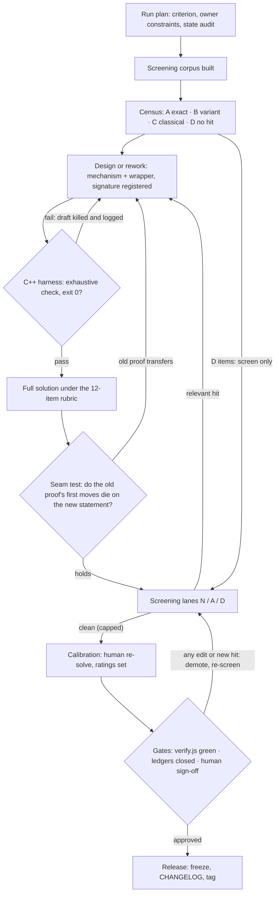

# METHODOLOGY — how this set was made and how its claims are checked

Version 1.2 · 2026-10-01. This file describes the **stable procedure**: the rules a
problem must pass, and the evidence the repo keeps for each claim. Volatile state —
run logs, per-problem verdict history, repair notes — does **not** live here; it
lives in `CHANGELOG.md` (the full 2026-09 production log is archived out-of-repo at
`../imo_shortlist.CHANGELOG.full-2026-09.md`; `CHANGELOG.example.md` ships the
mandatory entry format).

**When documents disagree:** the code in `tools/` decides gates and thresholds;
`problems.js` decides state; this file decides procedure and vocabulary. If you
change the code, update this file in the same commit.

The one-sentence version: every problem is **machine-checked before it is trusted**,
**screened for prior art as thoroughly as an honest search can be**, **calibrated by
a human who re-solved it**, and **shipped with its limits written down, not papered
over**. The set claims no absolute novelty; a clean search is evidence, never proof.

---

## 1. The process at a glance



The loops are the point. A harness kills bad designs before a proof is written, a
prior-art hit sends a design back through the same loop, and any later edit demotes
the problem until it is re-screened. Nothing moves forward on hope.

## 2. Roles: who may write what

- **Orchestrator (single writer).** Only one actor edits the dataset, ledgers and
  CHANGELOG in a run, applies verdicts produced by others, re-fetches every cited
  source before a final claim, and runs the gates.
- **Agents (design, solve, audit).** They produce artifacts — drafts, proofs,
  harnesses, cold-solve logs, screen adjudications. Their recall of "I have seen
  this problem before" is a *hypothesis*, never evidence. They never edit the dataset.
- **Human (owner).** Sole authority for originality promotion, the final difficulty
  ladder, quality scores, and release sign-off.

Cadence: mathematical work (redesigns, proof repairs, cold solves) is **one problem
per turn** — batching math compounds errors. Mechanical work (screens, ledger
bookkeeping) may batch 5–10 problems. A half-committed wave never ships. Each run is
identified as `RUN-YYYYMMDD-NN` and stamped into every CHANGELOG entry it produces.

## 3. What ships: the dataset contract

`problems.js` exposes `window.IMO_SHORTLIST` — 100 problems, 4 categories × 25
(algebra, combinatorics, geometry, number theory) — rendered by `imo_shortlist.html`
+ `app.js` with MathJax, no build step.

Every problem carries exactly these fields:

| field | required | meaning |
|---|---|---|
| `id` | yes | `a1..a25`, `c1..c25`, `g1..g25`, `n1..n25`; the number is the difficulty rank inside the category |
| `category` | yes | `alg` / `cmb` / `geo` / `nt`, matching the id prefix |
| `difficulty` | yes | `warmup` / `easy` / `medium` / `hard` / `challenging` |
| `stars` | yes | the band index 1–5 of `difficulty` — the two must agree |
| `rating` | yes | numeric difficulty 1–10 in 0.5 steps, calibrated per §7; must sit inside its `difficulty` band's `scale` range, stay ≤ 9.5, and be non-decreasing along the ids |
| `confidence` | yes | how much the difficulty estimate is trusted: `high` (human re-solved it), `medium` (human estimate with a caveat), `low` (explicitly doubtful) |
| `text` | yes | the statement, TeX + HTML; `<`/`>` in math written `&lt;`/`&gt;` |
| `why` | yes | mathematical content only — key ideas, exact facts, higher-math connections; no process chatter |
| `hints` | yes | at least 1 nudge, weaker than any step |
| `steps` | yes | at least 3 ordered solution steps, written from the finished proof |
| `remark` | yes | the idea's lineage in plain words: what classical motif the problem grows out of; since 2026-10-01 remarks carry the precise higher-mathematics relation and a `read about` recommendation naming what the solver who used that technique should study next — `Origin:` the classical motif lineage, `Higher math:`, then the recommendation (owner instruction; applied to alg/cmb/nt 2026-10-01, to geo on the 2026-10-02 pass) |

Two injection pipelines, and every field must obey the one it goes through.
`text` and `steps` are injected into `innerHTML` **raw**: `<`/`>` in math are written
`&lt;`/`&gt;` there (a bare `<` starts a browser tag and corrupts the card). `why`,
`hints` and `remark` pass through the viewer's `escapeHtml()` first: writing `&lt;`
in them double-escapes, so MathJax receives a literal `&lt;` and renders red
"Misplaced &" boxes — use the TeX macros `\lt`/`\gt` (doubled as `\\lt`/`\\gt` in
the JS source; a single backslash is eaten by JS string escapes) or a plain `<`.
V6 in `tools/verify.js` enforces all of this, and the markup of every field was
checked end-to-end through the page's CDN MathJax bundle (RUN-20261001-09).

Production-internal metadata (separate `answer`, novelty verdicts, readiness state)
is deliberately **not** in the public file — verify.js rejects it as a leak. The
numeric `rating` moved into the public file with the 2026-10-01 calibration pass
(owner decision; it was production-internal before) and is rendered by the viewer.
Answers live inside the final proof steps; the per-problem novelty and proof
record lives in the production ledgers and the archived CHANGELOG.

Three labels are kept **independent and never merged**: difficulty (what a solver
faces), proof (whether we verified it), originality (what the search found). They
travel separately and can disagree; e.g. a `verified` proof says nothing about novelty.

## 4. Where the problems come from

### 4.1 The corpus, then the census

Before authoring anything, a ~230 MB screening corpus is built: the IMO Compendium
(1959–2004), shortlists 2006–2023, ~45 national contests, Putnam, plus journal and
handout material — about 187k normalized text chunks in SQLite FTS5. Rebuild steps
and, just as importantly, the **fixed list of un-searchable surfaces** (AIME/AMC,
China TST, Korea, Japan, Turkey, Poland, journal columns, most books) are in
`tools/corpus/README.md`. That gap list is quoted in every residual-risk note.

Every existing item was then bucketed by prior-art evidence:
**A** exact known problem · **B** known problem in different clothing · **C** classical
staple whose claim itself is a known exercise · **D** nothing found. A, B and C went
through the redesign loop below; D items kept their statements and went to screening
only. Every pinned source had to be **opened** — a search snippet is not evidence —
and existing attributions were re-verified rather than trusted (that diligence caught
at least one wrong credit).

### 4.2 Design rules

Each new statement is built from a named **mechanism** — a modern idea with a proven
elementary collapse — and a **wrapper domain** (graphs, sets, sequences, games, …).
The mechanism catalog:

| code | mechanism | code | mechanism |
|---|---|---|---|
| M1 | system coupling (FE dynamics) | M9 | arithmetic-function identities |
| M2 | obstruction pairing (extremal theory) | M10 | counting upgrade (yes/no → exact) |
| M3 | mismatched equality (pqr/uvw refinement) | M11 | matching/deficiency games |
| M4 | finite-field lifting | M12 | discrete↔continuous bridges |
| M5 | linear algebra mod p | M13 | field-degree obstructions |
| M6 | spectral quadratic forms | M14 | chip-firing invariants |
| M7 | composition/degree growth | M15 | polar/inversion duality |
| M8 | p-adic valuation chains | M16 | certified identities (SOS certificates) |

Rules, all machine-checked through `tools/signatures.json`:

- a mechanism drives **at most 4 problems**;
- no (primary, secondary) signature pair is ever used twice;
- no problem's primary first-move code matches the known original it was derived from;
- any wrapper domain is used **at most 5 times**;
- families of answer type (find-all, sharp bound, existence, exact number, threshold,
  impossibility) and topic must stay balanced across the set — gaps are filled by
  *converting* an existing item, never by inventing filler inside an audit wave.

The quality bar for a statement: **one sentence to state, five minutes to understand,
two pages to solve.** Contest-idiomatic, self-contained, and the intended solution
requires no computational machinery (the harnesses below are for *us*, not for solvers).

### 4.3 What never counts as a redesign

A transformation is **cosmetic — auto-rejected — if the only change is**: renaming
functions or re-lettering points; swapping numbers inside the same constraint shape;
adding a vacuous hypothesis; one algebraic wrapping layer the old proof defeats
word-for-word; or re-skinning a classical claim as a story. A valid redesign must
break at least one of: the old solution's invariant, the solution set, the question
type, or the constraint geometry.

## 5. Checking a problem is right

### 5.1 The machine harness comes first

Verification code is **C++ with exact integer/rational arithmetic** under
`-Werror`, exhaustive on the finite space it declares:

```
g++ -std=c++17 -O2 -Wall -Wextra -Werror tools/proofs/<id>.cpp -o tools/proofs/build/<id>
```

Each harness states in its header the claim, the method, the bounds and the overflow
analysis; it prints per-case results and exits 0 only if **every** case passes.
Counting and games are enumerated completely; inequalities get exact-rational SOS/uvw
certification plus seeded random trials; geometry checks claimed collinearities and
concurrencies in exact rationals with degenerate-shape sweeps; NT sweeps parameters to
a stated bound with explicit non-instance witnesses. Where the space is truly too
large, sampling is labeled "probe", never "check".

**A design whose harness fails is archived as evidence and rethought — never shipped
"needing polish".** Several plausible-looking designs died this way in production;
those failures are logged, because a killed draft is data.

### 5.2 The proof rubric

A solution is marked `verified` only when all twelve items pass:

1. the statement is precisely quantified;
2. every domain restriction is actually used;
3. every denominator, degree and existence assumption is checked;
4. all substitutions are legal (range, invertibility);
5. every implication is reversible where a classification is claimed;
6. all equality cases are proved, not exhibited;
7. every descent terminates;
8. every induction has an explicit base;
9. every "standard lemma" is proved or precisely cited;
10. every computational identity has a human-readable derivation;
11. all exceptional cases are handled;
12. the converse direction is checked.

Any later edit to a verified statement or proof drops it to `hold` with a written
`gapNote` until it is re-derived independently. Wording-only edits are allowed when
the entry argues that claim, quantifiers and all other fields are unchanged.

### 5.3 The seam test (reworks only)

For a redesign of known material, write the old solution and the new one side by
side. The redesign passes only when the **first three named moves of the old proof
are false or provably dead ends on the new statement**, and a second reviewer
independently confirms it. If the old proof transfers, escalate the design one notch
and retest. No seam is ever accepted "by vibes".

## 6. Checking originality as far as a machine honestly can

Three independent lanes, all recorded in the production ledgers:

- **N-lane (exact form)** — at least 8 queries built from the statement's own words:
  quoted TeX/digit tokens, head/tail phrase windows, sliding n-grams
  (`tools/lanes.py` drives the StackExchange search within its daily quota).
- **A-lane (paraphrase)** — at least 8 queries phrased from the mathematics instead:
  synonyms, other-language formulations, family and answer-signature queries.
  Mechanically independent from N: no A-query may repeat a 5-word run of the statement.
- **D-lane (corpus)** — `tools/screen.py`: exact-substring hits on distinctive
  fragments, bigram-containment scoring against all 187k chunks, and an
  answer-signature co-occurrence probe. A long exact hit mechanically flags the item
  as prior-art-suspect; mid-range containment lands in a gray band that a human
  adjudicates by opening the top matches.

A hit counts as **relevant** only if the opened page states the same claim — same
quantifier structure, same constraint geometry, equivalent answer. Genre-word
coincidences ("pigeonhole", "functional equation") are dismissed with a one-line
reason. Before any top verdict, every cited URL is **re-fetched**; a source that no
longer contains the claim invalidates the verdict.

The verdict ladder:

| verdict | meaning |
|---|---|
| `T0` | unverified — the honest default; blocks release |
| `T1` / `T1v` | relevant exact / variant hit → relabel honestly with source, or rework |
| `T2` | gray-band or classical-genre signal → redesign or relabel; may not sit unresolved |
| `T3-pending` | statement final, seam and signature recorded, some lane evidence deferred |
| `T3` | full lane bar met, every hit adjudicated irrelevant — **the ceiling of machine evidence** |
| `T4` | human-approved `original-source`; machines can never grant it |

Any new relevant hit, or any edit to the statement or proof, demotes the item back
into the loop. Each screened entry also carries a `residualRisk` line — one of
low / medium-low / medium / high, naming the un-searchable surface (e.g. Chinese
TST handouts) that could still hold the problem. The permanent honesty rule: **a
clean D-lane is recorded evidence, never a novelty proof.**

## 7. Difficulty calibration

Raw difficulty starts as a formula, ends as human judgment:

```
raw    = 0.7 · R_search + 0.3 · R_proof        (1 = trivial … 10 = research level)
rating = round_to_0.5( 5 + 1.8 · (raw − mean_cat) / sd_cat )
```

Agents first run a cold-attempt protocol (solve without reading `why`/`steps`; log
solved?, failed approaches, whether the winning move is a named pattern) and flag
search/proof disagreements. The **human then re-solves or proof-sketches every
problem and brute-force-checks answers**; the per-category renormalization above is
applied only to that pass, keeps the ordering, caps the top slot at 9.5 (10 is
reserved for research level), and sets the shipped `confidence`. The shipped public
`rating` follows the same ladder under one set-level constraint (owner calibration
rule, verify.js V9): each category's 25 ratings must average in [5.0, 5.5]; the four
category standard deviations carry no cross-set requirement; each rating
also sits inside its difficulty band's `scale` range and is non-decreasing along the
ids. `tools/calibrate_ratings.js` regenerates the shipped grid deterministically
under exactly these constraints. Ids are renumbered
into rating order **only at wave boundaries**, remapping every ledger reference by
identity; mid-wave monotonicity is tolerated, then repaired. Blind contestant timing
is the declared upgrade path: until it exists, ratings are honestly labeled
human-estimated, not contestant-derived.

## 8. Gates

### 8.1 `node tools/verify.js` — the machine gates on the public dataset

| gate | condition |
|---|---|
| V1 | structure: exactly 4 × 25, ids `a1..a25` etc. in order, prefix matches category, no duplicates |
| V2 | field contract: required fields present; no stray fields; **no internal production fields leaked into the public file** |
| V3 | labels: `difficulty` and `confidence` from their enums; `stars` equals the band index; `rating` on the 0.5 grid within 1–9.5 and inside its band's `scale` range |
| V4 | content: non-empty `text` and `why`; ≥1 `hints`; ≥3 non-empty `steps` |
| V5 | order: difficulty bands **and numeric ratings** non-decreasing along ids inside each category |
| V6 | markup: balanced `$…$` TeX in every rendered field; no raw `<` outside a known tag in the raw-injected fields; no HTML entities in the escapeHtml'd fields; no lone-backslash TeX commands or control chars |
| V7 | waves ledger: `tools/waves.json` assigns the 100 ids to W1–W4 exactly once |
| V8 | signature ledger: `tools/signatures.json` keys are real ids; no (primary, secondary) pair twice |
| V9 | set stats: each category's rating mean in [5, 5.5] |

Run it before and after every edit; anything non-zero means the repo is broken.

### 8.2 Ledgers and waves

`waves.json` records how the 100 items entered production: **W1** exact-prior-art
redesigns, **W2** variant redesigns, **W3** classical staples, **W4** screen-only.
`signatures.json` records each item's mechanism pair and status. Half a wave is never
committed; set-level audits (collision matrix, cross-similarity, renumbering) happen
only at wave boundaries.

### 8.3 The human gates

Machines stop at T3. What only humans may sign:

- **G2** originality promotion (T3 → T4) with a written memo;
- **G4** full candidate verification — independent statement and rigor audits;
- **G5** difficulty ladder and confidence, from a re-solve pass (contestant data when available);
- **G6** release sign-off — quality panel (elegance, insight, robustness, unique path,
  no one-line theorem kill, contest fit; mean ≥ 4.0, nothing < 3.0), confidentiality
  checklist, competition-rule check, and the six owner decisions recorded in the
  production readiness state (submission channel, prior-art standard, shortlist shape,
  pool and budgets, model endpoints for confidential text, and who adjudicates).

## 9. Change discipline

`CHANGELOG.md` is append-only; every edit class gets one entry in the format of
`CHANGELOG.example.md`: title + date + run id → what and why with **verbatim
before/after for math edits** → verification (harness, re-derivation note, evidence
files) → ledger bookkeeping → the gates line. Killed designs are logged as killed
with the falsifying output named. Honest gaps in older history are recorded *as
gaps*, never reconstructed from memory. While candidates are unpublished they are
treated as confidential: no public posting, no third-party retention, access logging.

## 10. Reproducing a similar set from zero

0. Write the run plan first: a measurable criterion, the owner's constraints, and an
   audited list of findings to fix — then scaffold `problems.js` (this contract +
   verify) and copy `tools/`.
1. Build the corpus (§4.1) *before* drafting, so screens interleave with design.
2. Draft each statement from a registered mechanism + wrapper + answer type (§4.2);
   late signature collisions are the most expensive failure mode.
3. Harness first (§5.1): a draft lives only after exit 0; kills are logged.
4. Prove it under the 12 items (§5.2); write `steps` last, from the finished proof.
5. Seam-test every rework of known material (§5.3).
6. Census (§4.1), then run all three lanes to bar (§6); H4-refetch before any top verdict.
7. Calibrate (§7): cold ladder → human re-solve → renormalize → confidence; renumber only at wave boundaries.
8. `node tools/verify.js` green; set-level audit over the whole collection.
9. Independent second-pass review, re-derived from the files alone — this leg is what
   catches repair-introduced gaps.
10. Human gates (§8.3), freeze, CHANGELOG, tag, ship the static trio.

Every ordering above is a dependency, not a preference.

## 11. Honest limits (never implied otherwise)

- **No absolute novelty is claimed, ever.** `screened` / T3 means: defensibly novel
  against §6's lanes, with the §4.1 gap list as named residual risk.
- Difficulty ratings are agent-screened and human-reweighted; there are no
  contestant timings behind them.
- Machine searches cap at T3; every T4 must name the human who approved it.
- Geometry items that reuse classical named configurations speak only to the exact
  statement searched — never to the configuration's century of publication.
- Where the production record has gaps (un-preserved before-text, skipped legs),
  they are written down as gaps.

## 12. Provenance

Retired into this file on 2026-10-01: `PLAN.md` (2026-09-27, the 10-step correction
plan; every later run copies its pattern — criterion + constraints + audits first),
the 2026-09-29 novelty census (A 16 / B 3 / C 27 / D 54), and the transformation
plan v3.0 (waves, signature ledger, screening doctrine). The full run-by-run record
lives in the archived CHANGELOG; this file keeps only what should still be true
after the next release.
